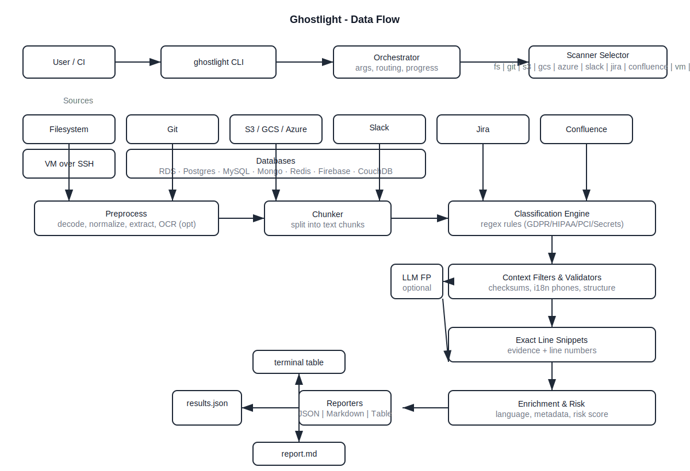

Architecture
============

Overview
--------
Ghostlight scans multiple sources (filesystems, git, cloud storage, SaaS, databases, VMs) and classifies content for PII/PHI/PCI/Secrets with language-aware detection and incremental reporting.

Mermaid Diagram
---------------

```mermaid
flowchart TD
  CLI[ghostlight CLI] -->|parse args| Orchestrator[Scan Orchestrator]
  Orchestrator -->|select scanner| Scanners{Scanners}

  subgraph Connectors
    FS[Filesystem]
    GIT[Git]
    S3[S3]
    GCS[GCS]
    AZB[Azure Blob]
    SLK[Slack]
    JIR[Jira]
    CONF[Confluence]
    VM[VM over SSH]
    RDS[AWS RDS]
    PG[Postgres]
    MY[MySQL]
    MGO[MongoDB]
    RDSH[Redis]
    FBASE[Firebase]
    CDB[CouchDB]
  end

  Scanners --> FS
  Scanners --> GIT
  Scanners --> S3
  Scanners --> GCS
  Scanners --> AZB
  Scanners --> SLK
  Scanners --> JIR
  Scanners --> CONF
  Scanners --> VM
  Scanners --> RDS
  Scanners --> PG
  Scanners --> MY
  Scanners --> MGO
  Scanners --> RDSH
  Scanners --> FBASE
  Scanners --> CDB

  %% Data flow
  FS -->|content chunks| Classifier
  GIT -->|diffs/blobs| Classifier
  S3 -->|objects| Classifier
  GCS -->|objects| Classifier
  AZB -->|blobs| Classifier
  SLK -->|messages| Classifier
  JIR -->|issues+comments+attachments| Classifier
  CONF -->|pages+comments+attachments| Classifier
  VM -->|files| Classifier
  RDS -->|rows| Classifier
  PG -->|rows| Classifier
  MY -->|rows| Classifier
  MGO -->|docs| Classifier
  RDSH -->|keys/values| Classifier
  FBASE -->|docs| Classifier
  CDB -->|docs| Classifier

  Classifier[Classification Engine]
  Classifier -->|regex rules| Patterns[Rules: GDPR/HIPAA/PCI/Secrets]
  Classifier -->|validators| Filters[Context Filters & Checksums]
  Classifier -->|langdetect| Lang[Language Detection]
  Classifier -->|i18n phones| Phone[Phone Validation]
  Classifier -->|snippets| Snip[Exact Line Snippets]
  Classifier -->|risk score| Risk[Risk Scoring]

  Classifier --> Reporter
  Reporter{Reporters} --> JSON[JSON (streaming)]
  Reporter --> MD[Markdown (streaming)]
  Reporter --> Table[Terminal Table]

  JSON -->|incremental write| OutJSON[(results.json)]
  MD -->|incremental write| OutMD[(report.md)]

  subgraph External SDKs/APIs
    Boto3[boto3]
    GCSdk[google-cloud-storage]
    AzureSDK[azure-storage-blob]
    SlackSDK[slack-sdk]
    Atlassian[requests: Jira/Confluence REST]
    Paramiko[paramiko SSH]
    DBDrivers[psycopg2 / pymysql / pymongo / redis / firebase-admin]
  end

  S3 --- Boto3
  GCS --- GCSdk
  AZB --- AzureSDK
  SLK --- SlackSDK
  JIR --- Atlassian
  CONF --- Atlassian
  VM --- Paramiko
  PG --- DBDrivers
  MY --- DBDrivers
  MGO --- DBDrivers
  RDSH --- DBDrivers
  FBASE --- DBDrivers
  RDS --- Boto3

```

Technologies
------------
- CLI and TUI: `click`, `rich`
- HTTP: `requests`
- Language detection: `langdetect`
- i18n phone validation: `phonenumberslite`
- Secrets/PII regex: `regex`
- OCR and docs: `pytesseract`, `pdfplumber`, `Pillow`, `python-docx`, `openpyxl`, `pdfminer.six`
- Archives: `py7zr`
- Cloud SDKs: `boto3`, `google-cloud-storage`, `azure-storage-blob`
- SaaS: `slack-sdk`, Atlassian REST (Jira/Confluence via `requests`)
- Databases: `psycopg2-binary`, `pymysql`, `pymongo`, `redis`, `firebase-admin`
- SSH/Remote: `paramiko`
- AI FP reduction (optional): `openai`, `anthropic`

Key Design Points
-----------------
- Incremental output streaming for JSON/Markdown
- Cursor-safe pagination for Atlassian APIs
- Unified exact line snippet extraction
- Centralized language metadata across all scanners
- Stronger secret validators (format + checksum)

Data Flow Diagram
-----------------

```mermaid
flowchart LR
  U[User/CI] --> CLI[ghostlight CLI]
  CLI --> ORCH[Orchestrator]
  ORCH -->|select scanner| SCN{Scanner}

  %% Sources
  subgraph Sources
    FS[Filesystem]
    GIT[Git]
    S3[S3]
    GCS[GCS]
    AZB[Azure Blob]
    SLK[Slack]
    JIR[Jira]
    CONF[Confluence]
    VM[VM over SSH]
    DBs[(RDS/PG/MySQL/Mongo/Redis/Firebase/CouchDB)]
  end

  SCN --> FS
  SCN --> GIT
  SCN --> S3
  SCN --> GCS
  SCN --> AZB
  SCN --> SLK
  SCN --> JIR
  SCN --> CONF
  SCN --> VM
  SCN --> DBs

  %% Ingestion
  FS -->|files| PRE[Preprocess]
  GIT -->|blobs/diffs| PRE
  S3 -->|objects| PRE
  GCS -->|objects| PRE
  AZB -->|blobs| PRE
  SLK -->|messages| PRE
  JIR -->|issues+comments+attachments| PRE
  CONF -->|pages+comments+attachments| PRE
  VM -->|files| PRE
  DBs -->|rows/docs| PRE

  PRE -->|normalize, decode, extract, OCR (opt)| CHUNK[Chunker]
  CHUNK -->|text chunks| CLASS[Classification Engine]
  CLASS -->|regex hits| FILT[Context Filters & Validators]
  FILT -->|validated detections| SNIP[Exact Line Snippets]
  SNIP -->|evidence + line no.| ENR[Enrichment]
  ENR -->|language, metadata, risk| FIND[Finding]

  subgraph Reporting
    FIND --> REP{Reporters}
    REP --> J[JSON Stream]
    REP --> M[Markdown Stream]
    REP --> T[Terminal Table]
  end

  J -->|append| OUTJ[(results.json)]
  M -->|append| OUTM[(report.md)]

  %% Optional AI filter branch
  CLASS -. optional -> AIF[LLM False Positive Filter]
  AIF -. reintegrate .-> FILT
```

Image
-----




